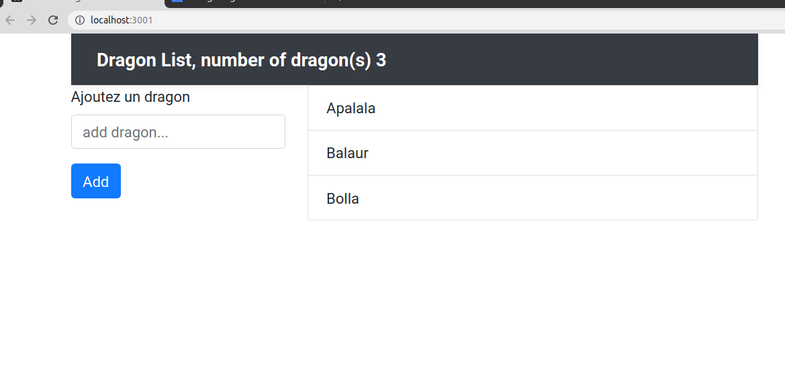

# Redux introduction

Rappelons que React est une librairie pour développer des interfaces utilisateurs. Dans ce sens les composants sont isolés, il n'est donc pas évident de partager les états des propriétés entre l'ensemble des composants dans l'application.

React propose la notion stable de context qui peut apporter des solutions. Mais pour une gestion plus complexe d'un state on utilisera de préférence Redux.

Redux fonctionne indépendemment de React et peut être utilisé seul. Avec Redux, on a comme avec le Context de React la notion de store, ce dernier est également **global**.

On pourra souscrire au state global, depuis n'importe quel composant, et récupérer les données du state en lecture seule. De même on pourra déclencher des actions depuis les composants afin de modifier le state global de Redux.

Redux impose un pattern au niveau de ses states. En effet,le state global sera notre source de vérité, à chaque fois qu'on voudra le changer on retournera une copie du state, sans toucher à la source de vérité.


## Présentation du reducer

**Redux c'est Reducer + flux ce qui donne Redux.**

Typiquement le reducer dans Redux est une fonction qui prend ses valeurs dans son state et les retourne modifiées, sans changer le state lui-même. Le pattern impose que pour des valeurs données le reducer retournera toujours le même état du state.

```js
let reducer = (state, action) => { /* return new state or state */}
```

## Principes du Pattern Redux

- Une unique source de vérité pour les states.
- Le state est en "read-only" (lecture seule).
- Les changements du state sont faits par des fonctions pures, aucun effet de bord; pour une valeur donnée on retournera toujours la même valeur.

## 01 Exemple Redux

Voyez dans les sources un exemple de code Redux pour vous faire une idée de son utilisation fichier **01_Example_Redux.html**.

### Subscribe

Pour écouter les changements du state on s'y abonnera à l'aide de la fonction subscribe du store, nous verrons plus tard un autre moyen pour récupérer le store de Redux dans les composants eux-mêmes.

```js
// s'abonner au store et écouter ses changements
store.subscribe(() => console.log(store.getState().questions) ) ;
```

## 02 Exercice Redux & React

Créez un projet pour ajouter un message avec Redux et affichez ces messages dans le DOM à l'aide de React. Voir le wireframe ci-après

Indication : n'utilisez pas le context API de React pour cet exercice pour essayez de globaliser le store. Pour vous connectez à votre store Redux utiliser le code ci-dessous :

```js

store.subscribe(() => {
  console.log(store.getState());
  // on remonte l'arbre de React pour mettre jour les données dans le DOM
  render();
});

const render = () =>
  ReactDOM.render(
    <App store={store} />
    ,
  document.getElementById("root")
);

// on départ on monte l'arbre 
render();
 ```
 
 Les liens pour React, Redux et Babel
 
 ```html
  <script src="https://unpkg.com/redux@latest/dist/redux.min.js"></script>
  <script src="https://unpkg.com/react@16/umd/react.development.js"></script>
  <script src="https://unpkg.com/react-dom@16/umd/react-dom.development.js"></script>
  <script src="https://unpkg.com/babel-standalone@6.15.0/babel.min.js"></script>
```
 
 Wireframe
 
 ```txt
 
  Ajoutez un message : [ ... ]
  
  Les messages : 
  Hello World 1
  Hello World 2
 
 ```


## Méthodes react-redux

Dans React nous pouvons globaliser le state de Redux et y accéder depuis n'importe quel composant.

Vous devez tout d'abord contextualiser l'application à l'aide du **Provider** de react-redux, c'est un préalable nécessaire pour consommer le store dans l'arbre de React :

```js
import { Provider } from 'react-redux';

const render = () => ReactDOM.render(
  <Provider store={store}>
    <App />
  </Provider>
  ,
  document.getElementById('root')
);

render();

```

## Hooks Redux

L'approche Hooks est beaucoup plus simple pour accéder au store ou de dispatcher une action. Nous ne parlerons pas ici de l'approche Objet de Redux dans les composants React.

### Lecture du store

On utilise le Hook useSelector, celui-ci est écrit dans react-redux, qui est une méthode simple pour lire (**read-only**) le store de Redux. Dans un composant :

```js

import Reactfrom 'react';

// le module react-redux permettant de travailler avec Redux dans React
import { useSelector } from 'react-redux'; 


const Messages = (props) =>{
    
    // permet de lire le state par décomposition de votre reducer et de récupérer la variables messages
    /*
        newState = { messages : ["Hello message1"] ; count : 1 } 
    */
    const { messages } = useSelector(state => state) ;
    
    return(
        <ul>
            {messages.map((m, i ) => <li key={i} >{m}</li> ) }
        </ul>
    )
}
```

### Dispatcher une action dans le contexte Hooks

Si vous souhaitez dispatcher une action vous utiliserez le hook suivant dans react-redux :

```js
import React from 'react';

// le module react-redux permettant de travailler avec Redux dans React
import { useSelector, useDispatch } from 'react-redux'; 

const Messages = (props) =>{
    const { messages, count } = useSelector(state => state) ;
    const dispatch = useDispatch();
    
    return(
      <>
        <ul>
            {messages.map((m, i ) => <li key={i} >{m}</li> ) }
        </ul>
        <p><button onClick={ () => dispatch({type : "ADD_MESSAGE", message : `Hello world ${count + 1}` }) } >Add message Hello + 1</button></p>
      </>
    )
}
```

## 01 Exercice Liste de Dragons Mise en place

Nous partirons d'un squelette d'application (create-react-app CRA) qui permettra d'ajouter/supprimer des dragons d'une liste définie.

Organisation des dossiers pour Redux. Dans le dossier constantes le fichier actions.js contiendra l'ensemble des constantes d'action. Dans le dossier actions le fichier actions-types contiendra l'ensemble des types d'actions passées aux fonctions du dispatcher. Et le dossier reducers contiendra l'ensemble des reducers, ici vous n'avez qu'une seule reducer pour cet exercice.

Lors de l'installation de Redux pensez à contextualiser votre store pour l'ensemble de l'application dans le fichier index.js.

Si vous le souhaitez vous pouvez utiliser Styled components pour définir les styles. Dans ce cas créez un dossier Styles pour gérer les composants stylisés. Si vous utilisez le Bootstrap CSS il faut alors importer le framework CSS à l'aide de la commande suivante :

```bash
npm install bootstrap
```

Puis l'importez directement dans le fichier index.js :

```js
import 'bootstrap/dist/css/bootstrap.min.css';

```

```txt

reducers/
    dragon.js. <--  reducer

constants/
    actions.js.  <--- les constantes export const ADD_DRAGON = "ADD_DRAGON" ; ...

actions/
    actions-types.js. <--- factoriser les actions du dispatcher dans une fonction, par add_dragon pour les écrire dans le code : dispatch( add_dragon( dragon ) )

```

Fichier constantes actions.js. On les utilise dans actions-types et dans le reducer.

```js
export const ADD_DRAGON = 'ADD_DRAGON';
// TODO ...
```

Fichier actions-types.js, factoriser le code dans le dispatch

```js
import { ADD_DRAGON } from '../constants/actions';

// payload correspond à ce que vous allez passer comme valeur à votre action { ... name : "Super dragon", force : 10 }
export const addDragon = payload => {
    return {
        type: ADD_DRAON, payload
    }
};
```

Notez que lorsque vous allez accéder aux valeurs dans vos action dans le reducer avec payload :

```js

const { name, force } = action.payload;

```

Utilisez ces constantes dans l'exercice.

### Reducer

Dans le fichier dragons.js

**Le reducer contient la logique qui s'appliquera sur les données du store, chaque modification des states conduira à la création d'un nouvel état.**

Voici le code du reducer que nous allons mettre en place :

```js
import { ADD_DRAGON } from '../constants/actions';

// initialisation des states : SOURCE DE VERITE
const initialState = {
    dragons: [
        "Apalala",
        "Balaur",
        "Bolla"],
    count: 0
}

const reducerDragon = (state = initialState, action = {}) => {
    switch (action.type) {
        case ADD_DRAGON:
            // TODO

            return { ...state }

        default:
            return state;
    }
}

export default reducerDragon;
```

Affichez la liste des dragons dans la colonne de droite :



### Partie 1 ajout d'un dragon

Rendez fonctionnel l'ajout du dragon. Puis utilisez Redux pour mettre à jour la liste des dragons dans la colonne de droite.

Faites en sorte que l'incrémentation du nombre de dragons se fasse également dans une barre de navigation (voyez l'image précédente).

Gérez les erreurs lors de l'insertion d'un dragon (champ vide, insertion d'un même dragon interdit).

Vous afficherez dans la barre de navigation le nombre de dragon(s) dans le store (voir le wireframe).

### Partie 2 suppression d'un dragon

Vous allez maintenant ajouter la fonctionnalité de suppression d'un dragon. Faites attention à bien nommer vos actions (convention de nommage).

### Partie 3 inversion de la liste des dragons

Ajoutez un bouton dans l'application qui permet d'inverser l'ordre d'affichage de la liste des dragons. Placez ce bouton en-dessous du bouton de l'ajout des dragons.
